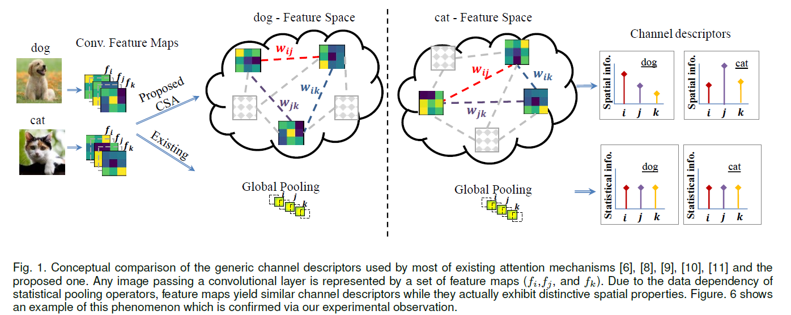

# CSA-Net: Channel-wise Spatially Autocorrelated Attention Networks

## Introduction
Recently, convolutional neural networks (CNNs) with channel-wise feature refining mechanisms bring noticeable benefits to modelling channel dependencies. However, current attention paradigms fail to infer an optimal channel descriptor capable of simultaneously exploiting statistical and spatial relationships among feature maps. In this paper, to overcome this shortcoming, we present a novel channel-wise spatially autocorrelated (CSA) attention mechanism. Inspired by geographical analysis, the proposed CSA exploits the spatial relationships between channels of feature maps to produce an effective channel descriptor. To the best of our knowledge, this is the first time that the concept of geographical spatial analysis is utilized in deep CNNs. The new spatially autocorrelated channel descriptor employs a unique hybrid spatial contiguity measure based on directional metrics to effectively measure the degree of spatial closeness between feature maps. The proposed CSA imposes negligible learning parameters and light computational overhead to the deep model, making it a powerful yet efficient attention module of choice. We validate the effectiveness of the proposed CSA networks (CSA-Nets) through extensive experiments and analysis on CIFAR-10/100, ImageNet-1K, and MS COCO benchmark datasets for image classification, object detection, and instance segmentation. The experimental results demonstrate that CSA-Nets are able to consistently achieve competitive performance and superior generalization than several state-of-the-art attention-based CNNs over different benchmark tasks and datasets.

  

## Installation
- git clone https://github.com/nick-nikzad/CSA-Net.git
- cd CSA-Net
- pip install -U openmim
- mim install mmcv-full
- pip install -v -e .

## MS-COCO object detection train
bash ./tools/dist_train.sh configs/faster_rcnn/faster_rcnn_r50_fpn_2x_coco.py 2 --work-dir checkpoints/csa_r50

## MS-COCO instance segmentation
bash ./tools/dist_train.sh configs/mask_rcnn/mask_rcnn_r50_fpn_2x_coco.py 2 --work-dir checkpoints/csa_r50_inSegm
